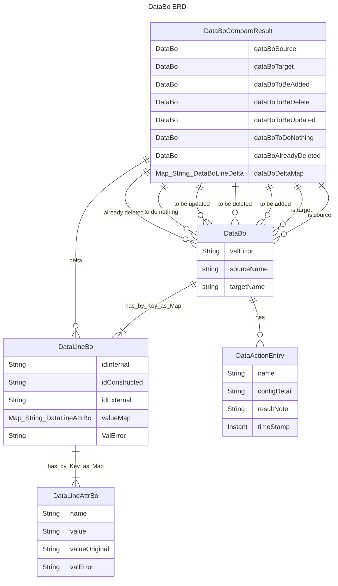
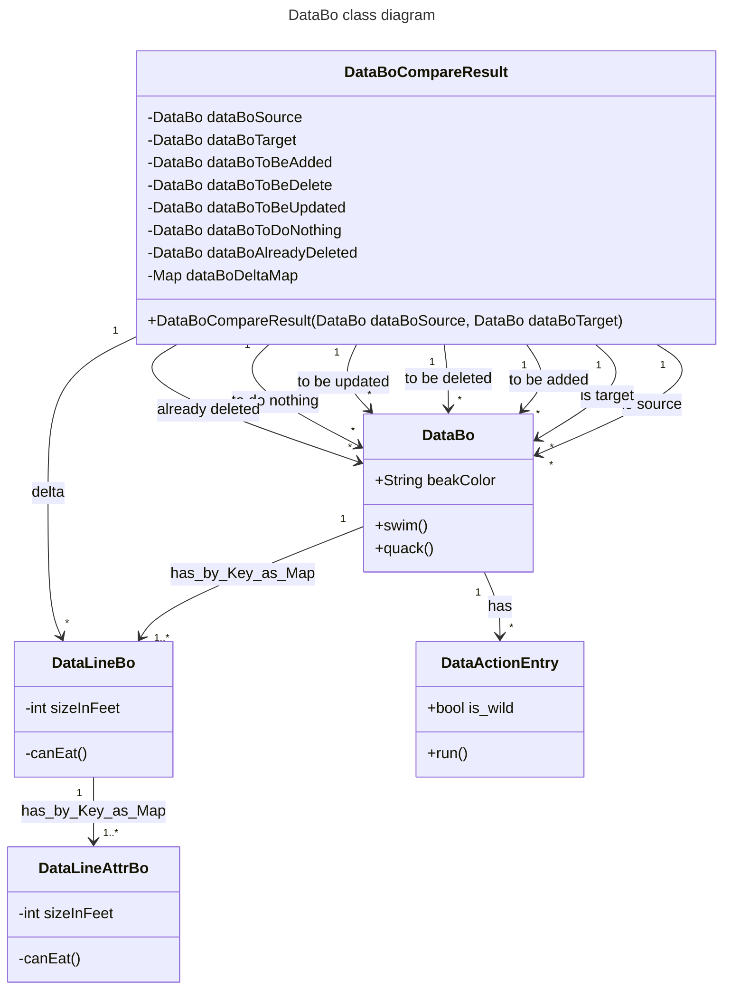
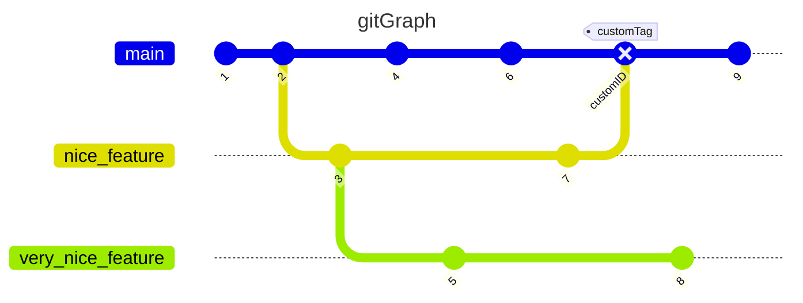

# Themen (TODO's)

- Release-Flow
  - Git-Commits
  - GitHub-Release
  - GPG-Signing
  - Automation
  - Testing
- Vorgaben
- Erklärung des Codes und der Funktionsweise
- Kontaktdaten und wie man als Entwickler dabei sein kann

- Github environment

- Entwicklungsumgebung - Entwicklersystem

# DataBo ERD

# Funktionsweise

| Objekt              | Funktionales Equivalent                                 |
|---------------------|---------------------------------------------------------|
| DataBoCompareResult | Deltaset von Tabellen zur Beschreibung der Unterschiede |
| DataActionEntry     | Aktionslogbuch                                          |
| DataBo              | Tabelle                                                 |
| DataLineBo          | Zeile                                                   |
| DataLineAttrBo      | Zelle                                                   |

# DataBo class diagram

