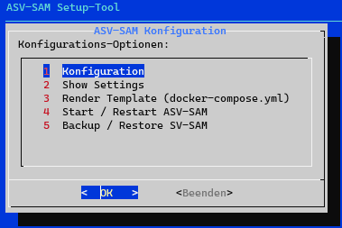
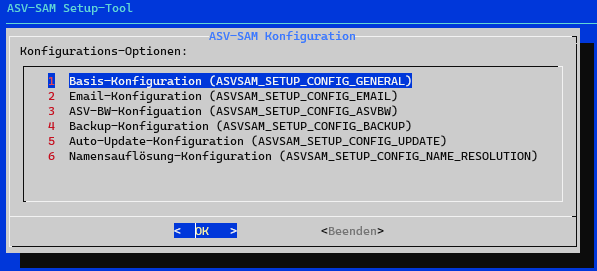
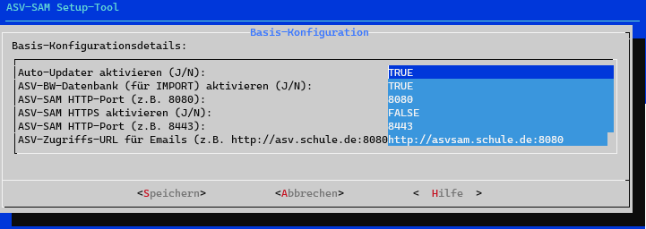
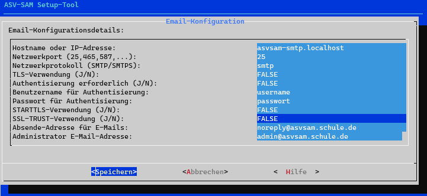
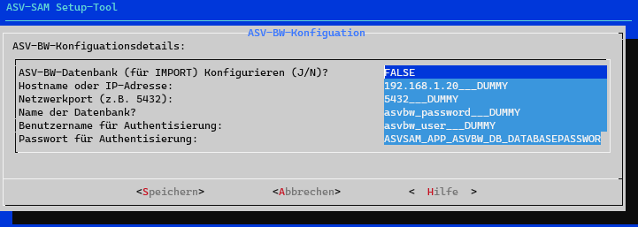
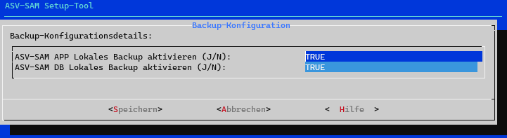
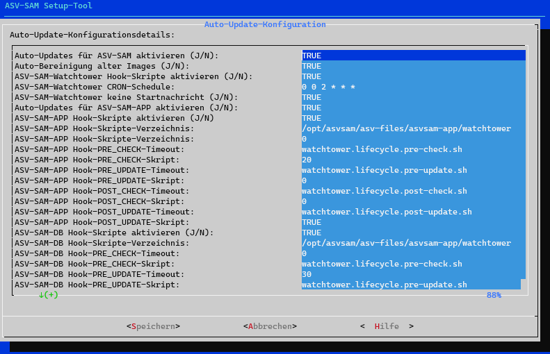
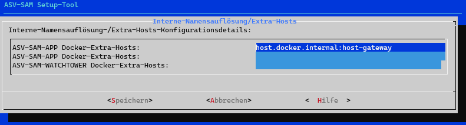
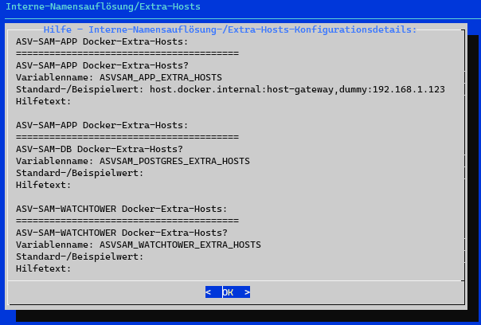

# Handbuch ASV-SAM - Setup-Tool


Das ASV-SAM-Setup-Tool dient der initialen installation und OS-Systemseitigen Konfiguration von ASV-SAM.

Die ausführung des Tools erfolgt entweder bei der Initialen Installation (siehe ..ddd) automatisch, 
oder manuell über die eingabe des folgenden Befehls auf der Kommandozeile des Installationssystems:

```shell
/opt/asvsam/setup.sh
```

## Hauptmenü


### Konfigurationsmenü


### Konfigurationsmenü - Basis


### Konfigurationsmenü - E-Mail


### Konfigurationsmenü - ASV-BW


## Konfigurationsmenü - Backup


### Konfigurationsmenü - Auto-Update


### Konfigurationsmenü - Namensauflösung



### Kontext-Hilfe


